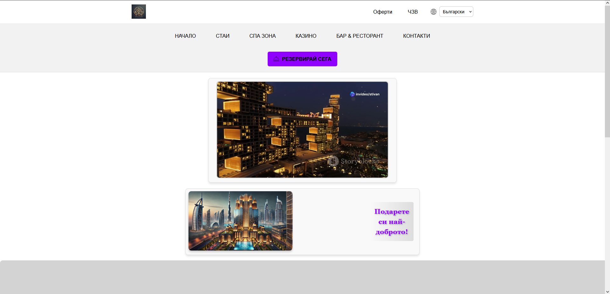
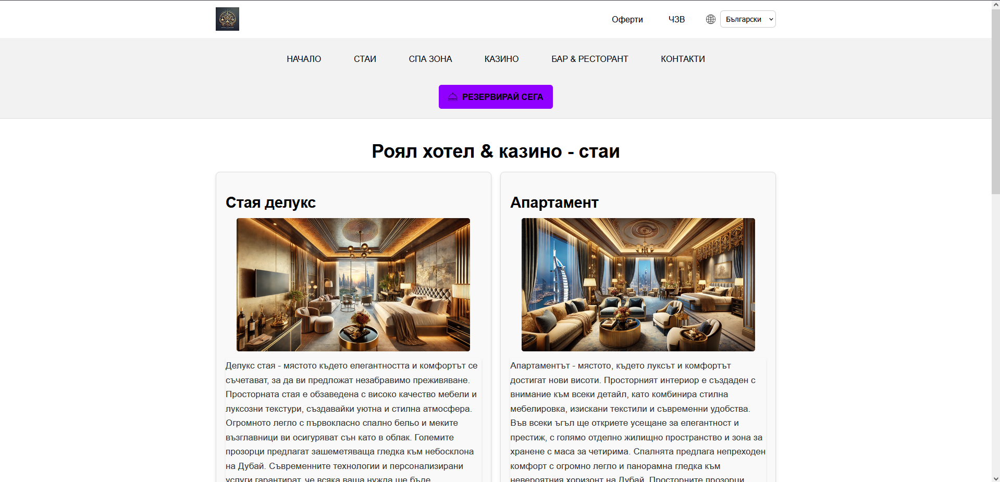
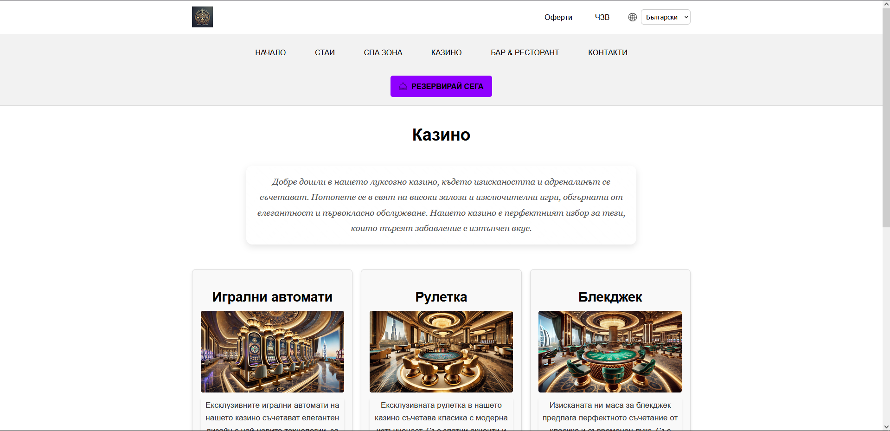
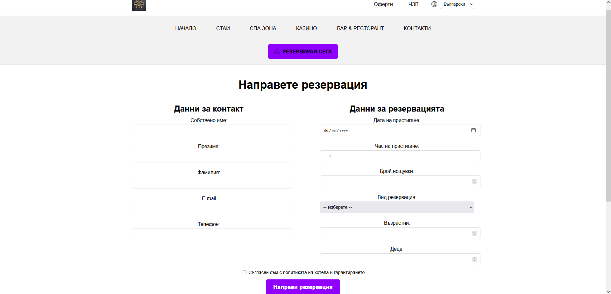
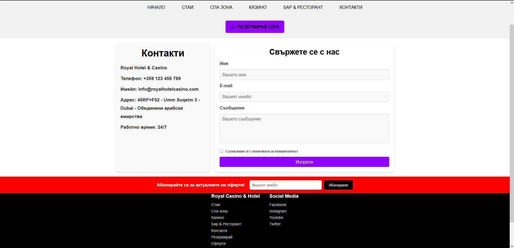

# Hotel Royal – Static Website

Multi-page responsive hotel website built **from scratch** using HTML, CSS, and vanilla JavaScript.  
This project was created as a **course assignment**, with all code written by me, to practice core frontend fundamentals and building a complete static website.

## Live Demo
🔗 https://stivanp.github.io/hotel-royal-static-website/

---

## Overview
Hotel Royal is a multi-page website presenting a fictional hotel with various sections such as rooms, spa zone, casino, restaurant, and reservation system.  
The project focuses on clean structure, responsive layout, reusable components, and basic client-side interactivity.

---

## Key Features
- Multi-page website with consistent navigation
- Reusable **header and footer** loaded dynamically with JavaScript
- Responsive layout suitable for desktop and mobile devices
- Homepage hero section with **video rotation**
- Client-side **form validation** (Contact & Reservation forms)
- Toast notifications for user feedback
- Minimum date logic for reservation arrival date

---

## Tech Stack
- **HTML5**
- **CSS3**
- **Vanilla JavaScript** (no frameworks or libraries)

---

## Project Structure
```
text
/
├─ index.html
├─ rooms.html
├─ reservation.html
├─ contact.html
├─ header.html
├─ footer.html
├─ barAndRestaurant.html
├─ casino.html
├─ comingsoon.html
├─ faq.html
├─ offers.html
├─ spazone.html
├─ css/
│  ├─ header.css
│  ├─ footer.css
│  ├─ animations.css
│  ├─ rooms.css
│  ├─ reservation.css
│  └─ ...
├─ js/
│  └─ script.js
├─ images/
├─ videos/
├─ screenshots/
└─ README.md
```

## Screenshots

### Home


### Rooms


### Casino


### Reservation


### Contact



## How to Run Locally
Because the header and footer are loaded using `fetch()`, the project should be run from a local server.

### Option 1: VS Code Live Server (recommended)
1. Open the project folder in VS Code
2. Install the **Live Server** extension
3. Right-click `index.html` → **Open with Live Server**

### Option 2: Python local server
```bash
python -m http.server 5500
```

Then open:
```
http://localhost:5500
```

## Notes
- The website content is in Bulgarian (`lang="bg"`).
- This is a static project focused on frontend fundamentals rather than backend functionality.

## What I Would Improve Next
- Split `script.js` into smaller, feature-based modules
- Add shared CSS variables for colors, spacing, and typography
- Improve accessibility (ARIA roles, focus states, live regions)
- Add form submission handling with a backend or mock API
- Further refine responsive behavior for smaller devices

## License
This project is provided for educational and portfolio purposes.
